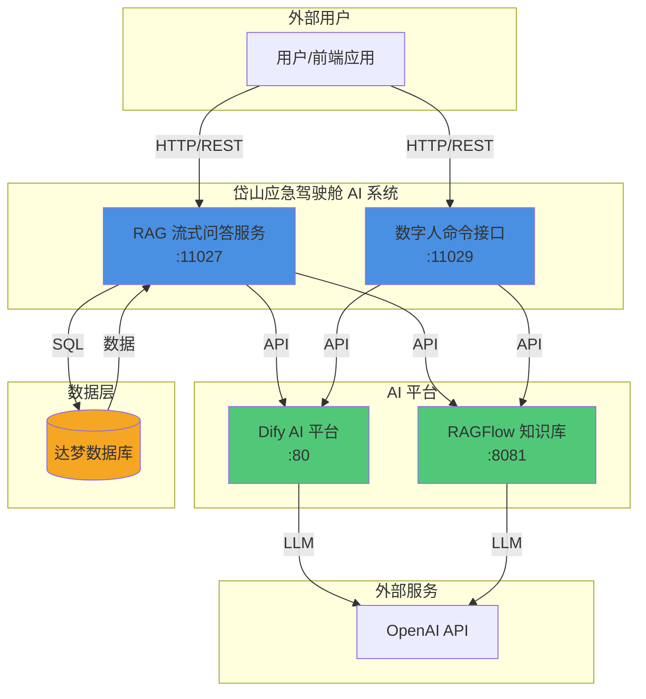
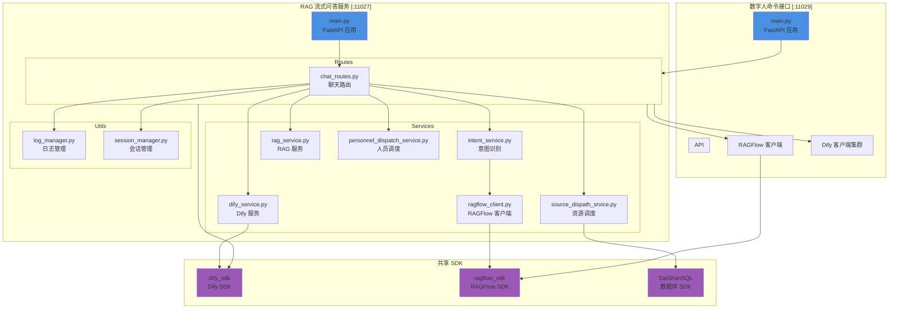
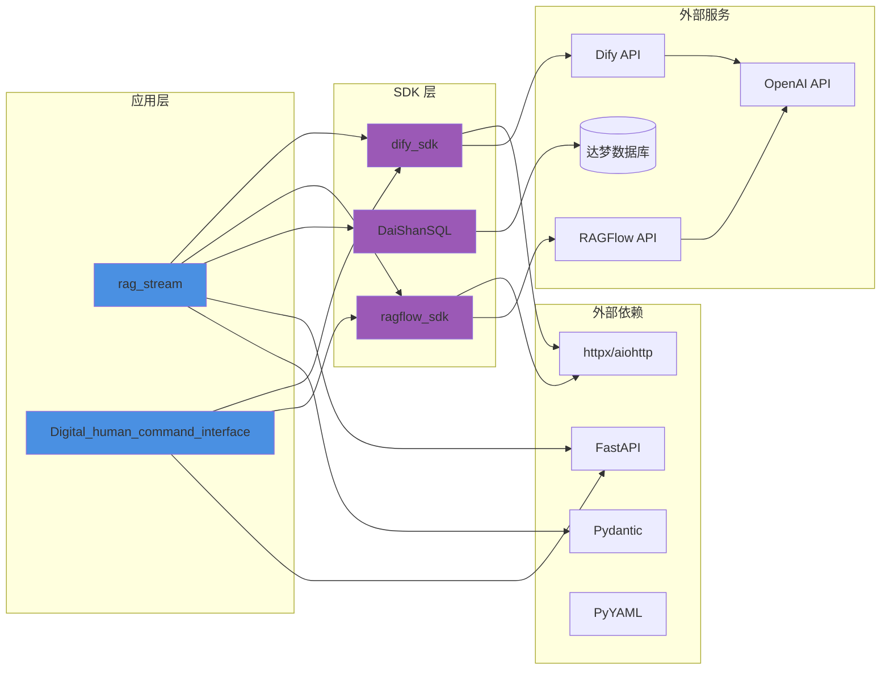
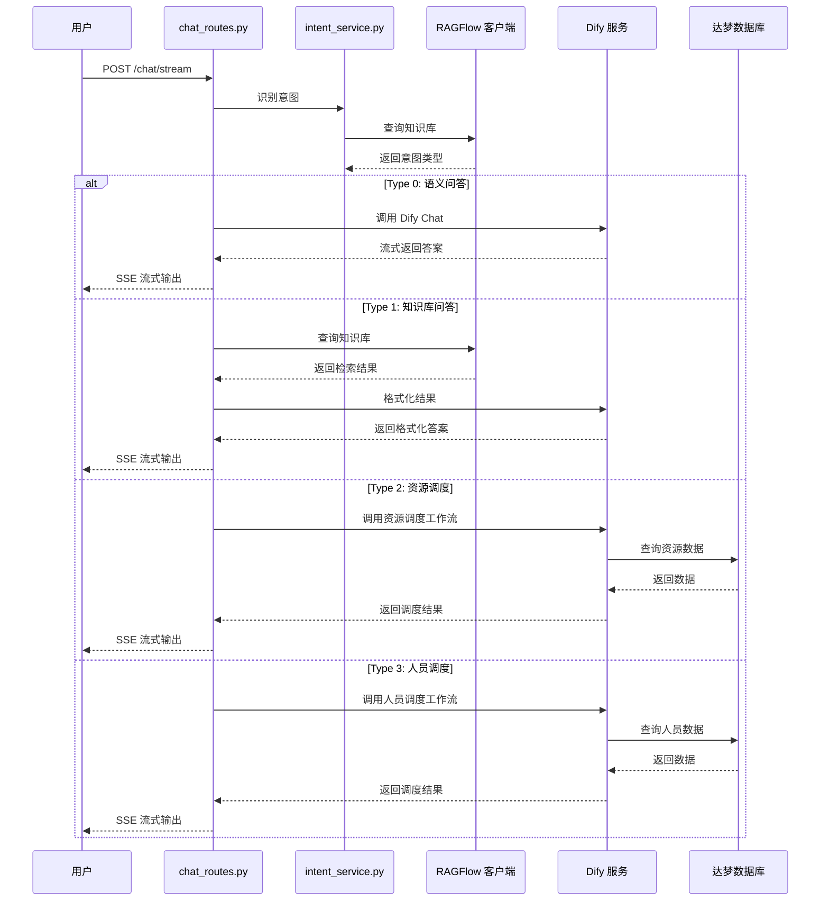
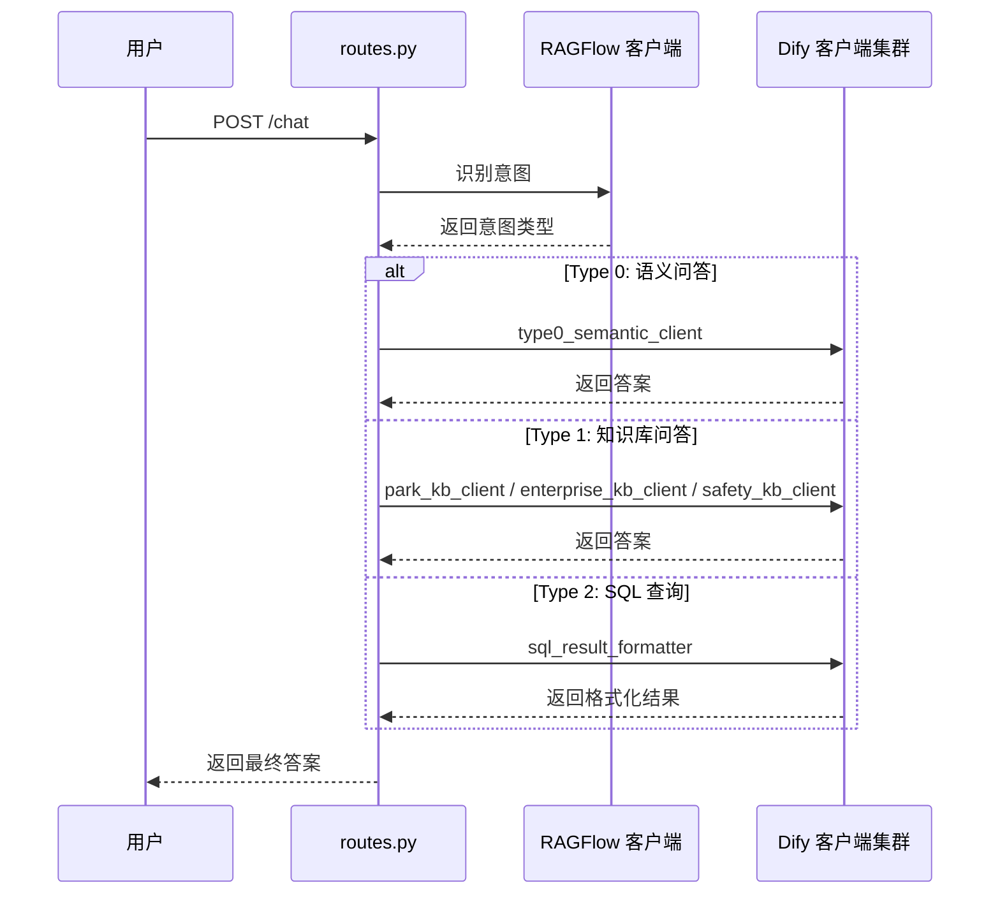
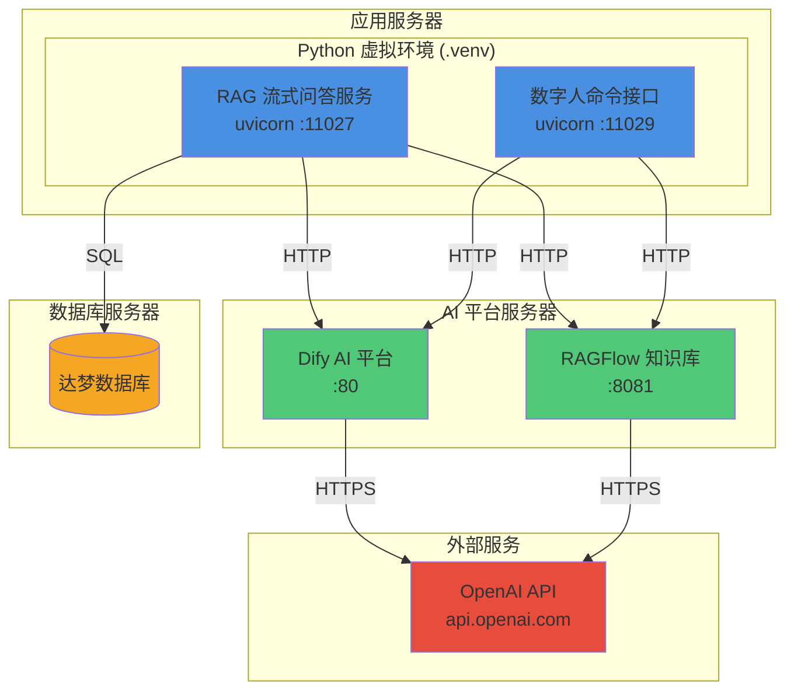
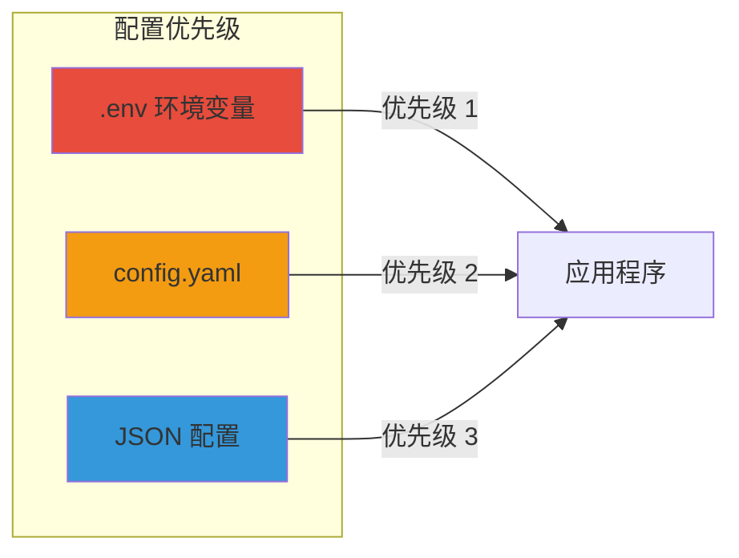
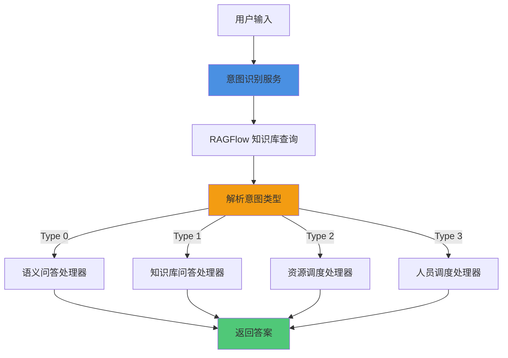

# 岱山应急驾驶舱 AI 系统架构设计

**文档版本**: 1.0.0
**创建日期**: 2026-02-04
**架构师**: 师爷
**项目**: daishan-refactor

---

## 1. 系统概述

岱山应急驾驶舱 AI 系统是一个基于 RAG（检索增强生成）技术的智能问答平台，集成了 Dify AI 工作流和 RAGFlow 知识库，为应急管理提供智能化支持。

### 1.1 核心能力

- **智能问答**: 基于多知识库的语义检索和生成式回答
- **意图识别**: 自动识别用户指令意图并路由到相应处理器
- **资源调度**: 应急资源的智能调度和分配
- **人员调度**: 应急人员的智能调度管理
- **流式响应**: 支持流式输出，提升用户体验

### 1.2 技术栈

| 技术 | 版本 | 用途 |
|------|------|------|
| Python | 3.12 | 开发语言 |
| FastAPI | 0.104.1 | Web 框架 |
| 达梦数据库 | - | 数据存储 |
| Dify | - | AI 工作流平台 |
| RAGFlow | - | 知识库检索 |
| uv | - | 包管理器 |

---

## 2. 系统架构

### 2.1 整体架构（C4 - Context）



### 2.2 容器架构（C4 - Container）



---

## 3. 模块依赖关系

### 3.1 项目文件结构

```
daishan-refactor/
├── rag_stream/                    # RAG 流式问答服务
│   ├── main.py                    # 服务入口
│   ├── .env                       # 环境变量（Dify/RAGFlow）
│   ├── config.yaml                # 服务配置
│   ├── src/
│   │   ├── config/
│   │   │   └── settings.py        # 配置管理
│   │   ├── models/
│   │   │   ├── schemas.py         # 数据模型
│   │   │   └── emergency_entities.py
│   │   ├── routes/
│   │   │   └── chat_routes.py     # 聊天路由
│   │   ├── services/
│   │   │   ├── dify_service.py    # Dify 服务
│   │   │   ├── intent_service.py  # 意图识别
│   │   │   ├── rag_service.py     # RAG 服务
│   │   │   ├── source_dispath_srvice.py  # 资源调度
│   │   │   ├── personnel_dispatch_service.py  # 人员调度
│   │   │   └── ragflow_client.py  # RAGFlow 客户端
│   │   └── utils/
│   │       ├── log_manager.py     # 日志管理
│   │       └── session_manager.py # 会话管理
│   └── tests/                     # 测试文件
│
├── Digital_human_command_interface/  # 数字人命令接口
│   ├── main.py                    # 服务入口
│   ├── .env                       # 环境变量
│   ├── config.yaml                # 服务配置
│   └── src/
│       └── api/
│           └── routes.py          # API 路由（核心业务）
│
├── dify_sdk/                      # Dify SDK
│   ├── client.py                  # 客户端实现
│   ├── config/                    # 配置管理
│   └── models/                    # 数据模型
│
├── ragflow_sdk/                   # RAGFlow SDK
│   ├── client.py                  # 客户端实现
│   ├── config/                    # 配置管理
│   └── models/                    # 数据模型
│
├── DaiShanSQL/                    # 达梦数据库 SDK
│   └── DaiShanSQL/
│       ├── .env                   # 数据库配置
│       └── [数据库操作模块]
│
└── docs/                          # 项目文档
    ├── static/                    # 静态文档
    ├── contexts/                  # 开发上下文
    └── archive/                   # 归档文档
```

### 3.2 依赖关系图



### 3.3 Python 包依赖

```yaml
核心依赖:
  - fastapi: 0.104.1          # Web 框架
  - uvicorn: 0.24.0           # ASGI 服务器
  - pydantic: 2.5.0           # 数据验证
  - pydantic-settings: 2.1.0  # 配置管理

HTTP 客户端:
  - aiohttp: 3.9.1            # 异步 HTTP 客户端
  - requests: 2.31.0          # 同步 HTTP 客户端

AI/LLM:
  - openai: >=2.15.0          # OpenAI SDK

配置与日志:
  - pyyaml: 6.0.1             # YAML 解析
  - python-json-logger: 2.0.7 # JSON 日志
  - python-dotenv: -          # 环境变量加载

其他:
  - python-multipart: 0.0.6   # 文件上传支持
```

---

## 4. 数据流架构

### 4.1 RAG 流式问答数据流



### 4.2 数字人命令接口数据流



---

## 5. 部署架构

### 5.1 服务部署拓扑



### 5.2 配置文件管理



**配置文件位置**:
- `rag_stream/.env`: Dify/RAGFlow API 配置
- `rag_stream/config.yaml`: 服务配置（超时、日志、意图识别）
- `Digital_human_command_interface/.env`: 数字人服务配置
- `Digital_human_command_interface/config.yaml`: 服务配置
- `DaiShanSQL/DaiShanSQL/.env`: 数据库连接配置

---

## 6. 核心模块说明

### 6.1 RAG 流式问答服务 (rag_stream)

**职责**: 提供基于 RAG 的智能问答服务，支持意图识别、资源调度、人员调度等功能。

**核心模块**:

| 模块 | 文件 | 职责 |
|------|------|------|
| 路由层 | chat_routes.py | 处理 HTTP 请求，路由到相应服务 |
| 意图识别 | intent_service.py | 识别用户意图（Type 0-3） |
| Dify 服务 | dify_service.py | 封装 Dify API 调用 |
| RAG 服务 | rag_service.py | RAG 检索和生成 |
| 资源调度 | source_dispath_srvice.py | 应急资源调度逻辑 |
| 人员调度 | personnel_dispatch_service.py | 应急人员调度逻辑 |
| RAGFlow 客户端 | ragflow_client.py | RAGFlow API 封装 |
| 日志管理 | log_manager.py | 统一日志管理 |
| 会话管理 | session_manager.py | 用户会话管理 |

**API 端点**:
- `POST /chat/stream`: 流式聊天接口
- `GET /`: 重定向到测试页面

### 6.2 数字人命令接口 (Digital_human_command_interface)

**职责**: 处理数字人指令，集成 Dify 和 RAGFlow，支持多知识库问答。

**核心模块**:

| 模块 | 文件 | 职责 |
|------|------|------|
| API 路由 | routes.py | 核心业务逻辑（57161 行） |
| 配置管理 | config.py | 配置加载和管理 |
| 日志管理 | log_manager.py | 日志记录 |
| RAGFlow 客户端 | ragflow_client.py | RAGFlow API 封装 |

**Dify 客户端集群**:
- `sql_result_formatter`: SQL 结果格式化
- `park_kb_client`: 园区知识库
- `enterprise_kb_client`: 企业知识库
- `safety_kb_client`: 安全信息知识库
- `type0_semantic_client`: 语义问答

### 6.3 Dify SDK (dify_sdk)

**职责**: 封装 Dify AI 平台 API，支持 Chat 和 Workflow 模式。

**核心功能**:
- Chat 模式：对话式交互
- Workflow 模式：工作流执行
- 流式输出支持
- 配置管理

### 6.4 RAGFlow SDK (ragflow_sdk)

**职责**: 封装 RAGFlow 知识库 API，支持文档、数据集、对话管理。

**核心功能**:
- 文档管理
- 数据集管理
- 对话管理
- 知识库检索

### 6.5 DaiShanSQL

**职责**: 封装达梦数据库操作，提供 SQL 查询和数据访问。

**核心功能**:
- 数据库连接管理
- SQL 查询执行
- 表结构获取
- 数据访问封装

---

## 7. 意图识别机制

### 7.1 意图类型

| Type | 名称 | 说明 | 处理方式 |
|------|------|------|----------|
| 0 | 语义问答 | 通用语义理解问答 | Dify Chat |
| 1 | 知识库问答 | 基于知识库的专业问答 | RAGFlow + Dify |
| 2 | 资源调度 | 应急资源调度 | Dify Workflow + 数据库 |
| 3 | 人员调度 | 应急人员调度 | Dify Workflow + 数据库 |

### 7.2 意图识别流程



---

## 8. 架构特点与优势

### 8.1 架构特点

1. **微服务架构**: 两个独立的 FastAPI 服务，职责清晰，易于维护和扩展
2. **SDK 封装**: 自研 dify_sdk 和 ragflow_sdk，统一 API 调用，降低耦合
3. **意图驱动**: 基于意图识别的智能路由，自动选择最佳处理方式
4. **流式输出**: 支持 SSE 流式响应，提升用户体验
5. **配置分离**: 环境变量、YAML、JSON 三级配置，灵活可控
6. **日志追踪**: 统一日志管理，支持函数追踪和会话追踪

### 8.2 技术优势

| 优势 | 说明 |
|------|------|
| **高性能** | 异步 I/O（FastAPI + asyncio），支持高并发 |
| **可扩展** | 模块化设计，易于添加新的意图类型和处理器 |
| **可维护** | 清晰的分层架构，职责单一，代码可读性高 |
| **可测试** | 完善的测试覆盖（19 个测试文件），保证代码质量 |
| **可观测** | 完善的日志系统，支持问题追踪和性能分析 |

### 8.3 设计原则

1. **高内聚低耦合**: 模块职责清晰，依赖最小化
2. **配置优先级**: .env > config.yaml > json，符合 12-Factor App
3. **快速失败**: 内部函数抛出异常，端点捕获并返回统一格式
4. **不可变性**: 避免修改原对象，使用函数式编程风格
5. **单一职责**: 函数 ≤30 行，文件 ≤800 行（部分历史代码除外）

---

## 9. 架构演进建议

### 9.1 短期优化（1-3 个月）

1. **代码重构**:
   - 拆分超大文件（如 routes.py 57161 行）
   - 提取公共逻辑到工具函数
   - 统一错误处理机制

2. **性能优化**:
   - 添加缓存层（Redis）
   - 优化数据库查询
   - 实现连接池管理

3. **测试增强**:
   - 提升测试覆盖率到 80%+
   - 添加集成测试和 E2E 测试
   - 实现自动化测试流程

### 9.2 中期优化（3-6 个月）

1. **服务治理**:
   - 引入服务注册与发现
   - 实现负载均衡
   - 添加熔断和限流机制

2. **监控告警**:
   - 集成 Prometheus + Grafana
   - 实现分布式追踪（Jaeger）
   - 建立告警机制

3. **安全加固**:
   - 实现 API 认证和授权
   - 添加请求签名验证
   - 实现敏感数据加密

### 9.3 长期规划（6-12 个月）

1. **容器化部署**:
   - Docker 容器化
   - Kubernetes 编排
   - CI/CD 自动化

2. **架构升级**:
   - 引入消息队列（RabbitMQ/Kafka）
   - 实现事件驱动架构
   - 支持多租户隔离

3. **AI 能力增强**:
   - 支持更多 LLM 模型
   - 实现模型路由和负载均衡
   - 添加模型微调能力

---

## 10. 附录

### 10.1 端口分配

| 服务 | 端口 | 说明 |
|------|------|------|
| rag_stream | 11027 | RAG 流式问答服务 |
| Digital_human_command_interface | 11029 | 数字人命令接口 |
| RAGFlow | 8081 | 知识库管理平台 |
| Dify | 80 | AI 工作流平台 |

### 10.2 关键文件清单

| 文件 | 行数 | 说明 |
|------|------|------|
| rag_stream/src/config/settings.py | 16715 | 配置管理（需重构） |
| rag_stream/src/routes/chat_routes.py | 12186 | 聊天路由（需重构） |
| rag_stream/src/services/source_dispath_srvice.py | 27859 | 资源调度（需重构） |
| rag_stream/src/services/prompts.py | 12695 | 提示词管理（需重构） |
| Digital_human_command_interface/src/api/routes.py | 57161 | API 路由（需重构） |

### 10.3 文档索引

- **API 文档**: [rag_stream/API接口文档.md](../../rag_stream/API接口文档.md)
- **接口文档**: [Digital_human_command_interface/接口文档.md](../../Digital_human_command_interface/接口文档.md)
- **项目配置**: [CLAUDE.md](../../CLAUDE.md)
- **开发规范**: [.claude/rules/python-dev-spec.md](../../.claude/rules/python-dev-spec.md)

---

**文档结束**
