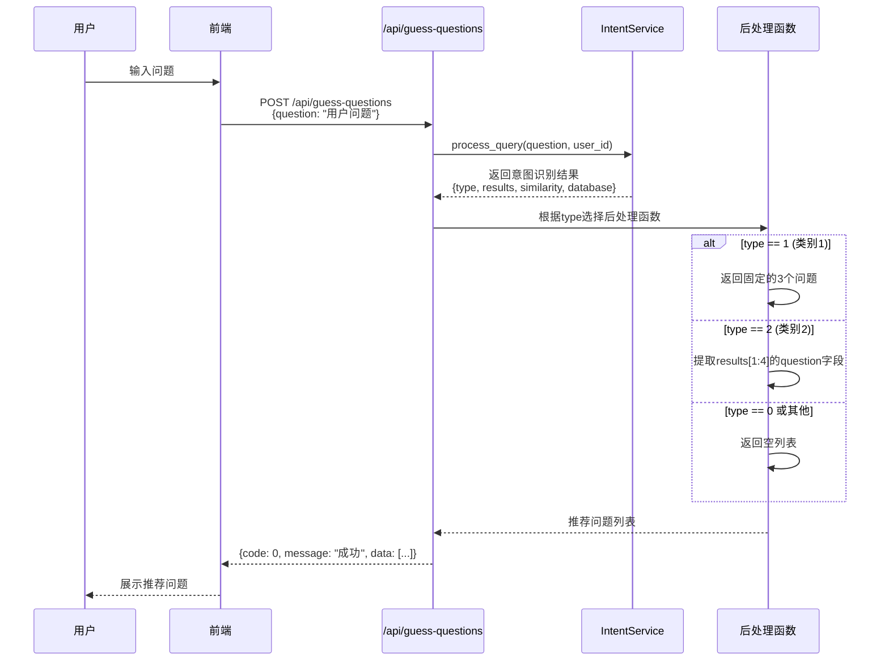
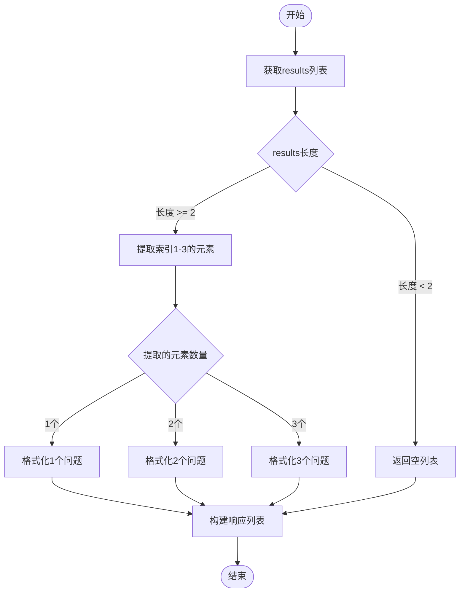
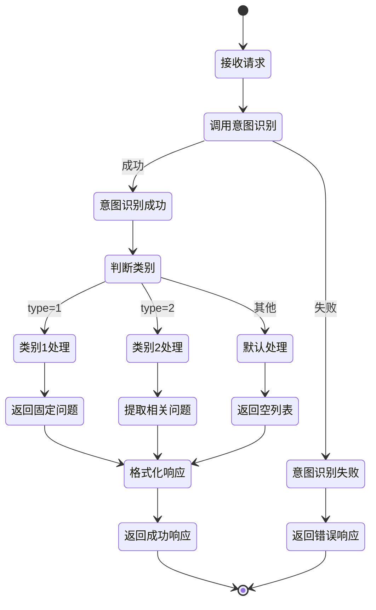
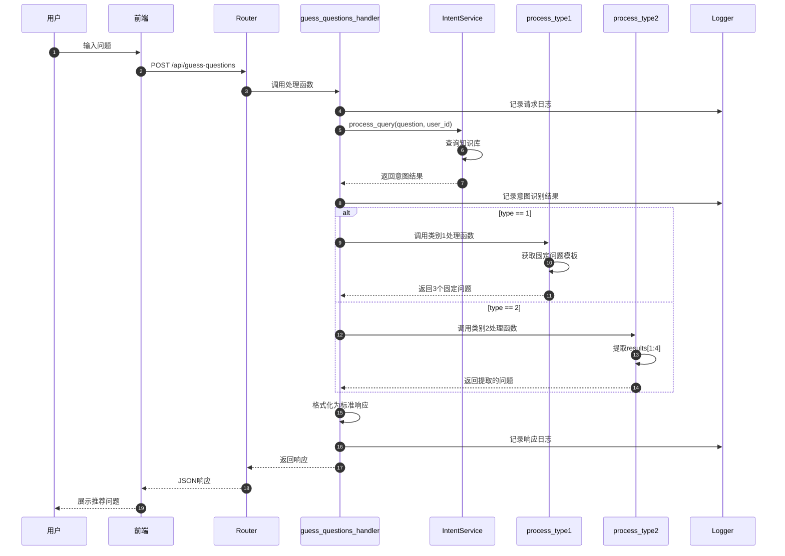

# 猜你想问功能 - 流程图

## 1. 整体流程图



## 2. 意图识别流程

```mermaid
flowchart TD
    Start([开始]) --> Input[接收用户问题]
    Input --> CallIntent[调用IntentService.process_query]
    CallIntent --> CheckError{调用成功?}

    CheckError -->|失败| ErrorHandle[错误处理]
    ErrorHandle --> ReturnError[返回错误响应]
    ReturnError --> End([结束])

    CheckError -->|成功| ParseResult[解析意图识别结果]
    ParseResult --> GetType[获取type字段]
    GetType --> CheckType{判断type类型}

    CheckType -->|type == 1| FixedQuestions[返回固定的3个问题]
    CheckType -->|type == 2| ExtractQuestions[提取results[1:4]的question]
    CheckType -->|其他| EmptyList[返回空列表]

    FixedQuestions --> FormatResponse[格式化响应]
    ExtractQuestions --> FormatResponse
    EmptyList --> FormatResponse

    FormatResponse --> ReturnSuccess[返回成功响应]
    ReturnSuccess --> End
```

## 3. 类别2问题提取流程



## 4. 错误处理流程

```mermaid
flowchart TD
    Start([开始]) --> TryCall[尝试调用IntentService]
    TryCall --> CheckException{是否抛出异常?}

    CheckException -->|无异常| ParseResult[解析结果]
    CheckException -->|有异常| LogError[记录错误日志]

    LogError --> CheckErrorType{异常类型}
    CheckErrorType -->|网络异常| NetworkError[返回"意图识别服务不可用"]
    CheckErrorType -->|数据格式异常| FormatError[返回"数据格式错误"]
    CheckErrorType -->|其他异常| GeneralError[返回"系统异常"]

    NetworkError --> BuildErrorResponse[构建错误响应]
    FormatError --> BuildErrorResponse
    GeneralError --> BuildErrorResponse

    BuildErrorResponse --> ReturnError[返回错误响应<br/>{code: 1, message: "...", data: []}]
    ReturnError --> End([结束])

    ParseResult --> CheckDataValid{数据有效?}
    CheckDataValid -->|有效| ProcessData[处理数据]
    CheckDataValid -->|无效| FormatError

    ProcessData --> End
```

## 5. 数据流图

```mermaid
flowchart LR
    A[用户问题] --> B[IntentService]
    B --> C{意图识别结果}
    C --> D[type: int]
    C --> E[results: List]
    C --> F[similarity: float]
    C --> G[database: str]

    D --> H{后处理逻辑}
    E --> H

    H -->|type=1| I[固定问题模板]
    H -->|type=2| J[提取results[1:4]]

    I --> K[推荐问题列表]
    J --> K

    K --> L[格式化为<br/>guess_your_question]
    L --> M[返回给前端]
```

## 6. 系统交互图

```mermaid
graph TB
    subgraph "前端层"
        A[用户界面]
    end

    subgraph "API层"
        B[/api/guess-questions]
        C[chat_routes.py]
    end

    subgraph "服务层"
        D[IntentService]
        E[后处理函数]
    end

    subgraph "数据层"
        F[RagflowClient]
        G[知识库]
    end

    A -->|HTTP POST| B
    B --> C
    C --> D
    D --> F
    F --> G
    G -->|查询结果| F
    F -->|意图识别结果| D
    D -->|意图结果| C
    C --> E
    E -->|推荐问题| C
    C -->|响应| B
    B -->|JSON| A
```

## 7. 状态转换图



## 8. 时序图（详细版）



## 流程说明

### 整体流程
1. 用户在前端输入问题
2. 前端调用 `/api/guess-questions` 接口
3. 接口调用 `IntentService.process_query()` 进行意图识别
4. 根据意图类型（type）选择不同的后处理函数
5. 格式化推荐问题列表并返回给前端
6. 前端展示推荐问题给用户

### 关键决策点
- **意图类型判断**：根据 `type` 字段决定使用哪种推荐策略
- **结果数量处理**：类别2需要处理结果不足3个的情况
- **错误处理**：捕获意图识别失败和数据格式错误

### 性能优化点
- 意图识别结果可以考虑缓存（后续优化）
- 固定问题模板可以预加载到内存
- 异步处理可以提升响应速度
