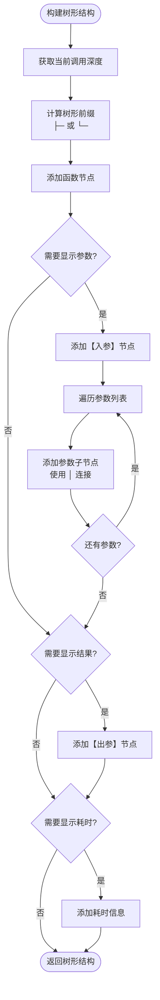
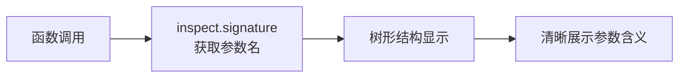
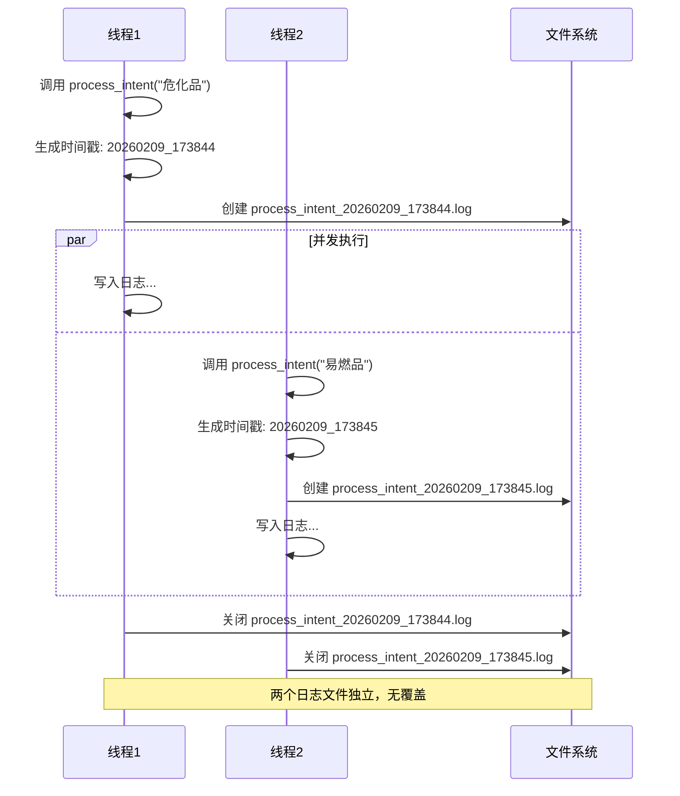
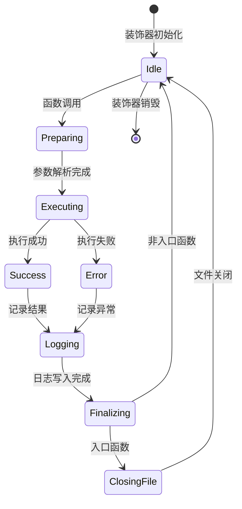
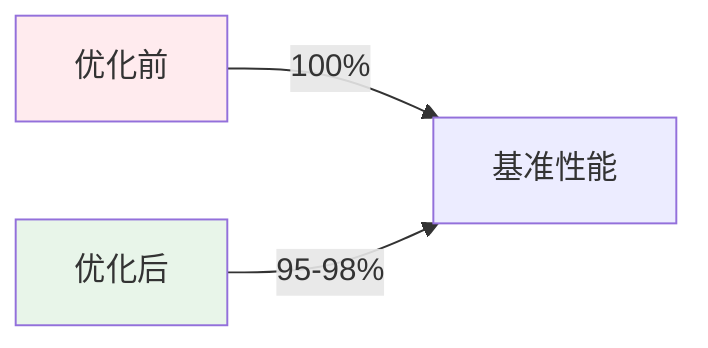
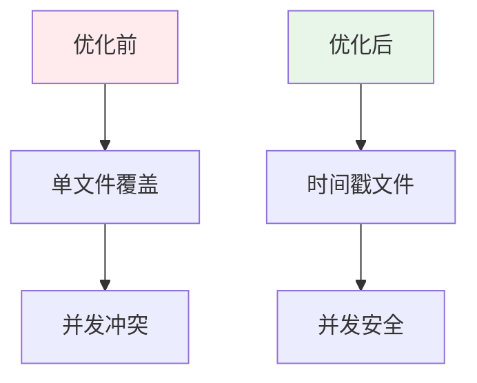

# log_decorator 优化流程图

## 1. 日志装饰器执行流程

```mermaid
flowchart TD
    Start([函数调用]) --> CheckEntry{是否入口函数?}

    CheckEntry -->|是| CreateLogFile[创建日志文件<br/>{func_name}_{timestamp}.log]
    CheckEntry -->|否| GetDepth[获取调用深度]

    CreateLogFile --> GetDepth
    GetDepth --> GetParams[获取函数参数信息]

    GetParams --> InspectSig[使用 inspect.signature<br/>获取参数名称]
    InspectSig --> BuildTree[构建树形结构]

    BuildTree --> LogStart[记录【开始执行】]
    LogStart --> CheckPrintArgs{print_args=True?}

    CheckPrintArgs -->|是| LogArgs[记录【入参】<br/>使用树形子节点]
    CheckPrintArgs -->|否| Execute

    LogArgs --> Execute[执行函数体]
    Execute --> CheckSuccess{执行成功?}

    CheckSuccess -->|是| CheckPrintResult{print_result=True?}
    CheckSuccess -->|否| LogError[记录【异常】]

    CheckPrintResult -->|是| LogResult[记录【出参】<br/>使用树形子节点]
    CheckPrintResult -->|否| CheckDuration

    LogResult --> CheckDuration{print_duration=True?}
    LogError --> CheckDuration

    CheckDuration -->|是| LogDuration[记录【执行完成】<br/>包含耗时信息]
    CheckDuration -->|否| LogComplete[记录【执行完成】<br/>不含耗时信息]

    LogDuration --> CheckEntryClose{是否入口函数?}
    LogComplete --> CheckEntryClose

    CheckEntryClose -->|是| CloseLogFile[关闭日志文件]
    CheckEntryClose -->|否| PopStack[出栈]

    CloseLogFile --> PopStack
    PopStack --> End([返回结果])
```

## 2. 参数名称获取流程

```mermaid
flowchart TD
    Start([获取参数]) --> TryInspect[尝试使用 inspect.signature]

    TryInspect --> CheckSuccess{获取成功?}

    CheckSuccess -->|是| ExtractNames[提取参数名称列表]
    CheckSuccess -->|否| UseFallback[使用回退方案]

    ExtractNames --> MapArgs[映射位置参数到参数名]
    UseFallback --> UseIndex[使用 args[0], args[1]...]

    MapArgs --> CheckKwargs{有关键字参数?}
    UseIndex --> CheckKwargs

    CheckKwargs -->|是| AddKwargs[添加关键字参数]
    CheckKwargs -->|否| FormatTree

    AddKwargs --> FormatTree[格式化为树形结构]
    FormatTree --> End([返回格式化字符串])
```

## 3. 树形结构构建流程



## 4. 入口函数日志文件管理流程

```mermaid
flowchart TD
    Start([入口函数调用]) --> CheckCurrent{当前有活跃<br/>入口函数?}

    CheckCurrent -->|是| SkipCreate[跳过文件创建<br/>使用现有日志]
    CheckCurrent -->|否| GenTimestamp[生成时间戳<br/>YYYYMMDD_HHMMSS]

    GenTimestamp --> BuildFilename[构建文件名<br/>{func_name}_{timestamp}.log]
    BuildFilename --> CreateFile[创建日志文件]

    CreateFile --> AddHandler[添加文件处理器]
    SkipCreate --> Execute[执行函数体]
    AddHandler --> Execute

    Execute --> CheckMermaid{force_mermaid=True?}

    CheckMermaid -->|是| GenMermaid[生成 Mermaid 图]
    CheckMermaid -->|否| RemoveHandler

    GenMermaid --> RemoveHandler[移除文件处理器]
    RemoveHandler --> CloseFile[关闭日志文件]

    CloseFile --> ClearEntry[清除入口标记]
    ClearEntry --> End([返回结果])
```

## 5. 优化前后对比流程

### 5.1 优化前：参数显示

```mermaid
flowchart LR
    A[函数调用] --> B[记录 args[0], args[1]...]
    B --> C[平铺显示]
    C --> D[难以理解参数含义]
```

### 5.2 优化后：参数显示



## 6. 并发场景日志文件管理



## 7. 优化点实现关系图

```mermaid
graph TD
    A[log_decorator 优化] --> B[优化点1: 参数名称显示]
    A --> C[优化点2: 参数树形结构]
    A --> D[优化点3: 默认不计算耗时]
    A --> E[优化点4: 删除 enable_mermaid]
    A --> F[优化点5: 入口函数重复防止]

    B --> G[parser.py<br/>新增 get_param_names()]
    B --> H[parser.py<br/>修改 format_args_multiline()]

    C --> H
    C --> I[decorator.py<br/>修改日志输出格式]

    D --> J[decorator.py<br/>修改 print_duration 默认值]

    E --> K[decorator.py<br/>删除 enable_mermaid 参数]

    F --> L[decorator.py<br/>修改日志文件命名逻辑]

    style B fill:#e1f5ff
    style C fill:#e1f5ff
    style D fill:#fff3e0
    style E fill:#fff3e0
    style F fill:#f3e5f5
```

## 8. 数据流图

```mermaid
flowchart LR
    A[函数调用] --> B[装饰器拦截]
    B --> C[获取参数信息]

    C --> D{inspect.signature}
    D -->|成功| E[参数名列表]
    D -->|失败| F[参数索引列表]

    E --> G[格式化为树形结构]
    F --> G

    G --> H[添加树形前缀]
    H --> I[写入日志文件]

    I --> J{是否入口函数?}
    J -->|是| K[写入 {func_name}_{timestamp}.log]
    J -->|否| L[写入 global.log]

    K --> M[日志文件]
    L --> M
```

## 9. 状态转换图



## 10. 优化效果对比

### 10.1 日志可读性对比

**优化前**：
```
2026-02-09 17:38:44 - INFO - _post_process_result - 【入参】
  - args[0]: <IntentService: 1 attrs>
  - args[1]: 危化品
  - args[2]: None
  - args[3]: <IntentResult: 5 attrs>
```

**优化后**：
```
2026-02-09 17:38:44 - INFO - ├─ _post_process_result - 【开始执行】
2026-02-09 17:38:44 - INFO - │  ├─ 【入参】
2026-02-09 17:38:44 - INFO - │  │  ├─ self: <IntentService: 1 attrs>
2026-02-09 17:38:44 - INFO - │  │  ├─ query: 危化品
2026-02-09 17:38:44 - INFO - │  │  ├─ context: None
2026-02-09 17:38:44 - INFO - │  │  └─ result: <IntentResult: 5 attrs>
```

### 10.2 性能对比



### 10.3 文件管理对比



---

## 总结

通过以上流程图，我们可以清晰地看到：

1. **参数名称显示**：通过 `inspect.signature` 获取参数名，提升可读性
2. **树形结构**：使用层级缩进和连接符，清晰展示调用关系
3. **耗时计算**：默认关闭，按需开启，减少性能开销
4. **Mermaid 控制**：简化接口，保留核心功能
5. **文件管理**：时间戳命名，防止并发覆盖

这些优化共同提升了 log_decorator 的可用性、性能和可靠性。
