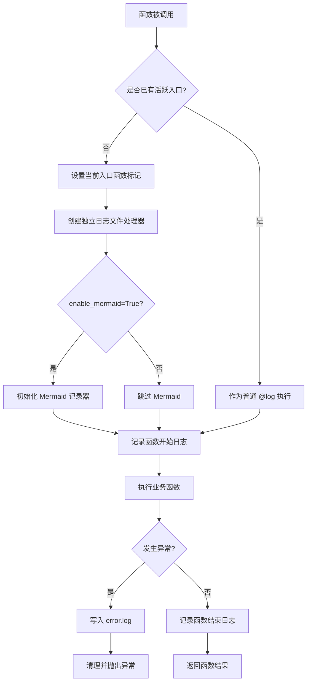
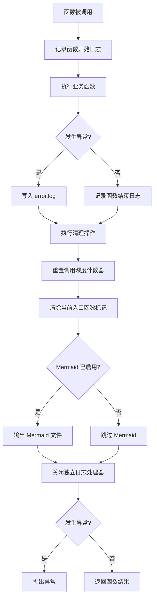
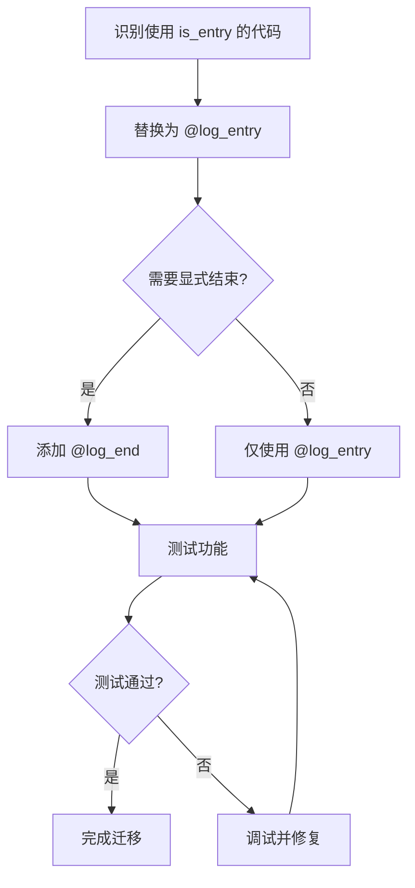

# 流程图

## 1. @log_entry 装饰器执行流程



---

## 2. @log_end 装饰器执行流程



---

## 3. 配对使用场景流程

```mermaid
flowchart TD
    A[API 请求到达] --> B[@log_entry 标记入口]
    B --> C[创建独立日志文件]
    C --> D[初始化 Mermaid 记录器]
    D --> E[执行业务逻辑]
    E --> F[调用多个子函数]
    F --> G[@log 记录子函数]
    G --> H[业务逻辑完成]
    H --> I[@log_end 标记结束]
    I --> J[输出 Mermaid 文件]
    J --> K[重置调用深度]
    K --> L[清除入口标记]
    L --> M[关闭日志处理器]
    M --> N[返回响应]
```

---

## 4. 嵌套调用场景流程

```mermaid
flowchart TD
    A[外层函数调用] --> B[@log_entry 设置入口 A]
    B --> C[执行外层逻辑]
    C --> D[调用内层函数]
    D --> E[@log_entry 尝试设置入口 B]
    E --> F{已有活跃入口?}
    F -->|是| G[作为普通 @log 执行]
    F -->|否| H[设置入口 B]
    G --> I[执行内层逻辑]
    H --> I
    I --> J[内层函数返回]
    J --> K[继续外层逻辑]
    K --> L[@log_end 清理状态]
    L --> M[外层函数返回]
```

---

## 5. 异常处理流程

```mermaid
flowchart TD
    A[@log_entry 开始] --> B[执行业务函数]
    B --> C{发生异常?}
    C -->|否| D[正常返回]
    C -->|是| E[捕获异常]
    E --> F[构建异常链信息]
    F --> G[脱敏入参数据]
    G --> H[写入 error.log]
    H --> I{Mermaid 已启用?}
    I -->|是| J[强制输出 Mermaid 文件]
    I -->|否| K[跳过 Mermaid]
    J --> L[清理调用栈状态]
    K --> L
    L --> M[重新抛出异常]
```

---

## 6. 调用栈状态管理

```mermaid
flowchart TD
    A[线程本地存储] --> B[调用深度计数器]
    A --> C[当前入口函数标记]
    A --> D[Mermaid 记录器]

    B --> E[@log_entry 不修改深度]
    B --> F[@log 增加深度]
    B --> G[@log_end 重置深度为 0]

    C --> H[@log_entry 设置入口]
    C --> I[@log_end 清除入口]

    D --> J[@log_entry 初始化记录器]
    D --> K[@log_end 输出并清理]
```

---

## 7. 迁移流程



---

## 使用场景示例

### 场景 1：API 请求处理

```python
@log_entry(enable_mermaid=True, message="处理用户登录")
def handle_login(username: str, password: str):
    user = authenticate(username, password)
    token = generate_token(user)
    return finalize_login(token)

@log_end(message="登录流程完成")
def finalize_login(token: str):
    log_audit_event("user_login", token)
    return {"token": token, "status": "success"}
```

### 场景 2：测试用例隔离

```python
@log_entry(message="测试订单创建")
def test_create_order():
    order = create_order({"item": "book", "quantity": 1})
    assert order["status"] == "created"
    cleanup_order(order["id"])

@log_end()
def cleanup_order(order_id: int):
    delete_order(order_id)
```

### 场景 3：业务流程边界

```python
@log_entry(enable_mermaid=True)
def process_payment(order_id: int):
    validate_order(order_id)
    charge_result = charge_payment(order_id)
    return complete_payment(charge_result)

@log_end()
def complete_payment(charge_result: dict):
    update_order_status(charge_result["order_id"], "paid")
    send_receipt(charge_result["order_id"])
    return {"status": "completed"}
```
